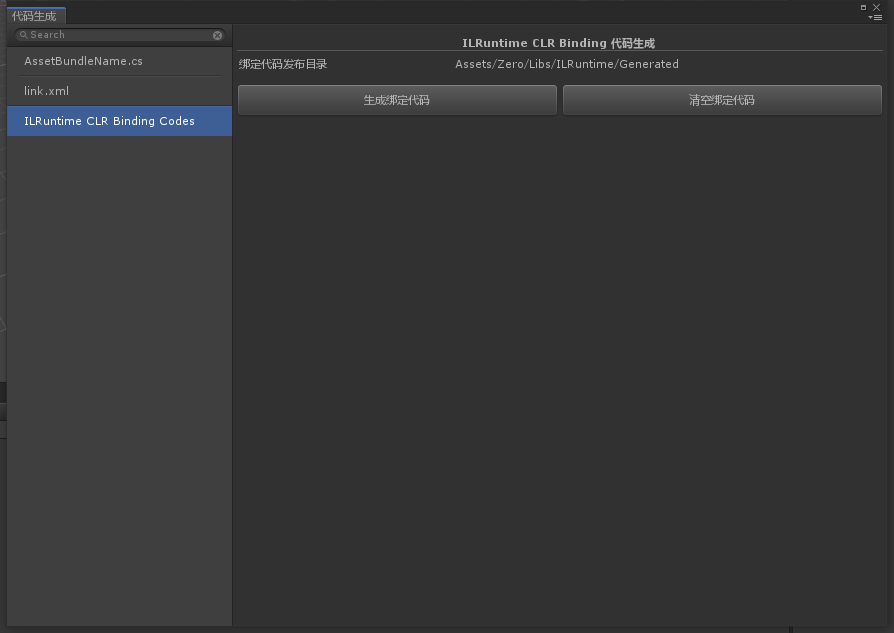

# Create Generated

>默认情况下，ILRuntime中调用Unity主工程的方法，ILRuntime会通过反射对目标方法进行调用，这个过程会因为装箱，拆箱等操作，产生大量的GC Alloc和额外开销，因此我们需要借助CLR绑定功能，将我们需要的函数调用进行静态绑定，这样在进行调用的时候就不会出现GC Alloc和额外开销了。

>Zero工具 ```[Zero/代码生成]``` 整合了ILRuntime的CLR绑定代码自动化发布的API，简化了CLR绑定代码的```生成/清空```操作。

>该工具则是可以自动在指定的目录下，根据打包的DLL(手动选择)生成ILRuntime绑定代码。

## 界面截图

