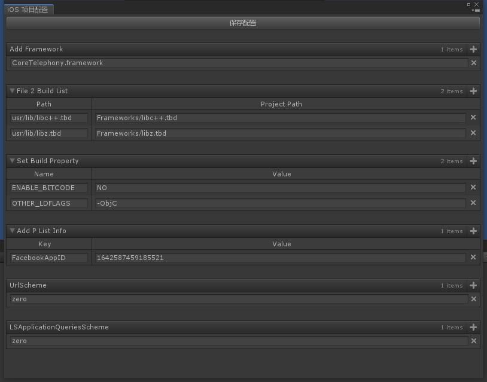

# iOS Project Init

>当unity在发布IOS平台项目的时候，首先会Build出一个XCode项目，再通过该项目打包成IPA。而我们有时候需要对这个XCode项目的一些配置进行定制，通过在这个工具里进行参数填写，我们可以在XCode项目Build出来的时候自动填入对应的参数。

配置内容:

- [AddFrameworkToProject](#AddFrameworkToProject)
- [AddFileToBuild](#AddFileToBuild)
- [SetBuildProperty](#SetBuildProperty)
- [AddPList](#AddPList)
- [AddUrlScheme](#AddUrlScheme)
- [AddLSApplicationQueriesScheme](#AddLSApplicationQueriesScheme)

## 界面截图

## AddFrameworkToProject
>XCode项目中需要添加的代码库

## AddFileToBuild
>XCode项目中需要添加的代码库

## SetBuildProperty
>XCode项目的编译参数设置

## AddPList
>XCode项目的PList参数添加

## AddUrlScheme
>XCode项目的UrlScheme配置

## AddLSApplicationQueriesScheme
>XCode项目信任的Scheme配置