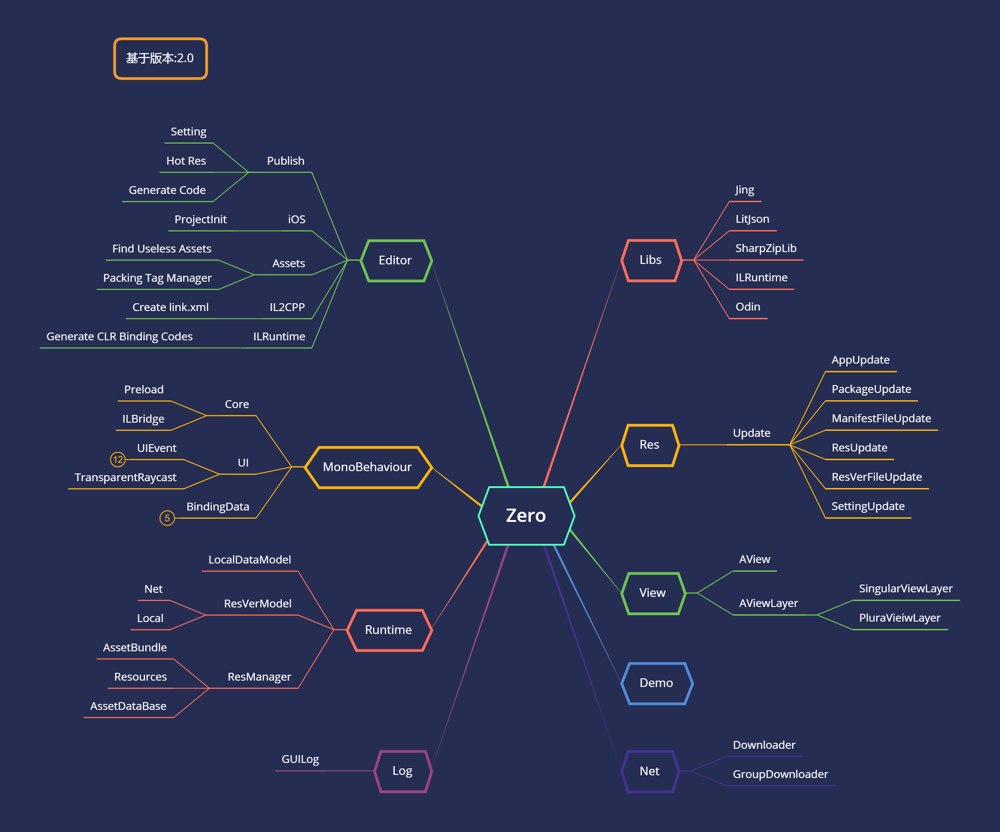

---

### 目录
- [从Demo开始](Demo.md)
- 框架内容
    - [Preload介绍](Preload.md)
    - [热更架构介绍](HotResIntro.md)
    - [视图管理](ViewFramework.md)
    - [资源管理](ResManager.md)
    - [其它](Other.md)
    - [扩展](Extend.md)
- Editor工具
    - 热更新
        - [setting.json](PublishSettingEditor.md)
        - [热更资源](PublishHotResEditor.md)
    - 自动生成代码
        - [AssetBundleName.cs](AssetBundleNameGenerate.md)
        - [link.xml](CreateLinkXML.md)        
        - [ILRuntime CLR Binding Codes](ILRuntimeGeneratedEditor.md)
    - 项目自动化配置
        - [iOS项目配置](IOSProjectInitEditor.md)        
    - 资源优化
        - [Packing Tag Manager](PackingTagEditor.md)
        - [查找项目无用资源](FindUselessAssetsEditor.md)         
- ILRuntime[(官方网站)](http://ourpalm.github.io/ILRuntime/public/v1/guide/index.html)        
- [Q&A](QuestionAnswer.md)
- [注意事项](Warning.md)

---

## 简介

Zero是在Unity中一套游戏开发框架，为游戏开发核心的问题提供了解决方案。其中包括但不限于：
- 资源管理
    - 可快速切换通过Resources接口加载资源的管理工具
    - 支持开发时通过AssetDataBase接口加载资源调试的管理工具
    - 支持通过AssetBundle加载资源的管理工具
- 视图管理
    - 不用继承MonoBehaviour的视图管理方案，提高视图部分的代码执行效率
- 项目统一使用C#的代码热更新
    - 基于ILRuntime热更框架（支持IL2CPP&Mono）
    - 基于动态Dll（仅支持Mono）
- 工具集
    - 热更资源发布工具
    - XCode项目参数配置工具
    - 资源优化快捷工具
    - IL2CPP工具
    - ILRuntime工具
    
>Zero的宗旨就是为想要快速入门的开发者提供一个可行的稳定的Unity项目开发解决方案。通过尽量简洁的使用方式来方便开发者快速上手，以及模块化的代码易于开发者扩展延伸代码的框架。

## 更多

>对Zero有一定了解后，可以通过以下两个Demo更深入Zero的使用

[2D游戏Demo(https://github.com/jinglikeblue/Zero2DGameDemo)](https://github.com/jinglikeblue/Zero2DGameDemo)

[3D游戏Demo(https://github.com/jinglikeblue/Zero3DGameDemo)](https://github.com/jinglikeblue/Zero3DGameDemo)

>对于Zero使用的代码热更方案ILRuntime，可以通过作者的网站深入了解

[ILRuntime(http://ourpalm.github.io/ILRuntime/public/v1/guide/index.html)](http://ourpalm.github.io/ILRuntime/public/v1/guide/index.html)
