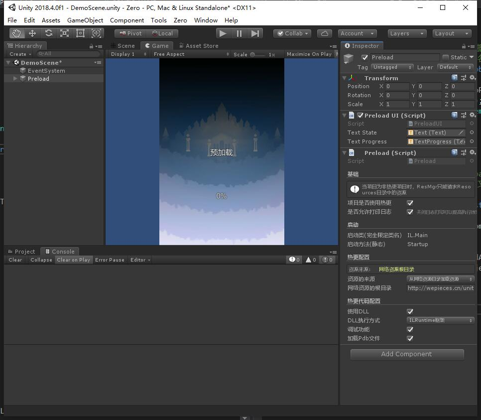

# Preload

### 目录
- [简介](#简介)
- [Zero的三种资源资源模式](#Zero的三种资源资源模式)
- [预热](#预热)
    1. [解压package.zip化](#1.解压package.zip)
    2. [检查/更新Setting.json](#2.检查/更新setting.json)
    3. [检查/更新客户端](#3.检查/更新客户端)
    4. [检查/更新启动资源](#4.检查/更新启动资源)
    5. [进入热更区域](#5.进入热更区域)
- [Preload配置参数详解](#Preload配置参数详解)

---

## 简介

> Zero中的Preload.cs脚本是整个程序预热的核心组件。

Hierarchy中的Preload是一个简单的游戏启动的加载视图，该视图可以由使用者自己安排，用来表示游戏的启动画面和加载进度。重要的是该GameObject上我们绑定了组件「Preload.cs」，该组件上的配置参数决定了程序在启动时的运行环境。

整个程序的预热过程都在该类中完成，其中依次包括：

1. [解压package.zip化](#1.解压package.zip)
2. [检查/更新Setting.json](#2.检查/更新setting.json)
3. [检查/更新客户端](#3.检查/更新客户端)
4. [检查/更新启动资源](#4.检查/更新启动资源)
5. [进入热更区域](#5.进入热更区域)

>PS:如果项目不使用热更，则Preload会直接进入[步骤5]

---

## Zero的三种资源资源模式

考虑到不同开发阶段对于资源获取的需求，Zero提供了以下三种资源的使用方式

- ***使用AssetDataBase加载资源***

当项目为一个热更资源项目时，开发者可以在开发阶段使用这种资源加载方式来进行调试开发。

- ***从本地资源目录加载资源***

当项目为一个热更资源项目时，开发者在打包出AssetBundle后，可以先通过本地的资源加载来测试资源是否正确

- ***从网络资源目录加载资源***

当项目为一个热更资源项目时，开发者在打包出AssetBundle并更新到资源服务器后，通过该加载方式来加载资源。该方式也是热更项目的正式安装包的资源加载方式。

---

## 预热
所谓预热，就是指在我们真正的逻辑代码开始执行前，Zero框架会把所有启动游戏必须的热更资源都提前准备好，再启动游戏业务逻辑内容。而我们的Preload.cs脚本就是负责Zero预热的。

预热的步骤如下：

### 1.解压package.zip
>在我们打包发布APP的时候，有些资源希望内嵌在APP中，那么我们可以选择将这些资源压缩为「package.zip」（**注意名字、大小写必须一致**），并放到StreamingAssets目录下，这样打包的时候便会和APP一起发布。

程序启动的时候，会检测如果是第一次安装程序，且存在package.zip，便会将其解压出来。解压后的资源使用方式和热更资源的使用方式一致，参考 **「资源管理解决方案」**

### 2.检查/更新setting.json
>setting.json可以理解为网络资源的入口文件，所有网络资源的加载都从这个配置文件开始。该文件可通过Editor工具进行配置/发布。

### 3.检查/更新客户端
>当客户端版本低于服务器配置时，会根据配置更新客户端。

### 4.资源更新检查
>加载热更资源的res.json(通过Editor工具发布)文件，并根据配置的启动资源组，比较并更新资源为最新版本。

### 5.进入热更区域
>当Zero完成了预热以后，则会启动@Scripts中的Main函数，并销毁Preload。

至此，整个游戏进入中间层(热更区域)阶段。

#### 预热的状态以及进度获取

Preload.cs提供了以下委托，用来获取当前Preload的情况：
- onStateChange  
当前预热状态切换时触发，参数表示进入的状态
- onProgress  
当前预热状态的进度[0 - 1]，以及总量
- onError
当预热出错时触发
---

## Preload配置参数详解
Inspector中参数解释：

- 项目是否使用热更  
如果没有勾选，则项目为本地项目，不依赖网络资源。通过ResMgr获取的资源，应都在Resources目录中。  

- 是否打印日志  
如果关闭该选项，打印的日志会自动屏蔽。  
注意：警告以及错误仍然会打印。建议正式版本关闭打印，可以提高性能

- 启动类以及启动方法  
预热完成后，启动方法将被调用，程序进入可热更区域。

- 资源来源

    - 从网络资源目录加载 将通过配置的网络目录获取setting文件，并下载热更资源

        - 网络资源根目录 该位置填写web服务器上放置资源的目录,格式通常为*http://wepieces.cn/unity/zero/demo/Res*这种

    - 从本地资源目录加载 将从*Zero/Publish/HotRes*中配置的Res发布目录下获取资源

        - 本地的资源根目录

    - 使用AssetDataBase加载(推荐开发阶段使用)

        - Asset中热更资源的目录 将从*Zero/Publish/HotRes*中配置的Res发布目录下获取资源

- 使用DLL *如果不勾选，则会通过安装包的代码执行程序。勾选后，将根据选择的方式执行HotRes打包出的DLL*

    - DLL执行方式
        - 选择ILRuntime解释执行DLL可以兼容MONO和IL2CPP
        - 选择反射执行，则只能兼容MONO，但是因为JIT的原因执行性能高于ILRuntime

    - 调试功能 开启后可以配合ILRuntime的调试工具，在真机环境调试DLL代码      

    - 加载Pdb文件 开启后可以在DLL中代码执行出错时打印错误堆栈信息
        
    
    
    