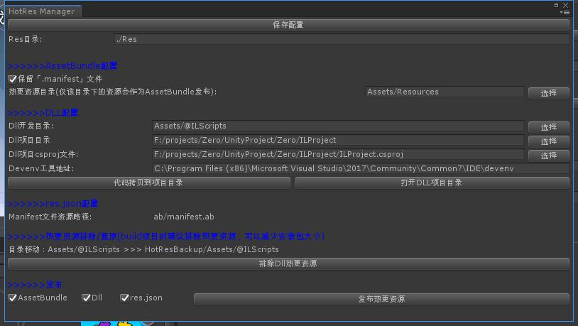

# 热更资源构建

构建内容:

- [DLL](#DLL)
- [AssetBundle](#AssetBundle构建)
- [res.json](#res.json)
- [Configs](#配置文件)

## 界面截图

## DLL
热更代码

## AssetBundle
视图资源AB包

## res.json
版本号描述文件，该文件将描述每一个热更资源的大小以及MD5版本号。

## Configs
拷贝配置文件内容到发布目录
