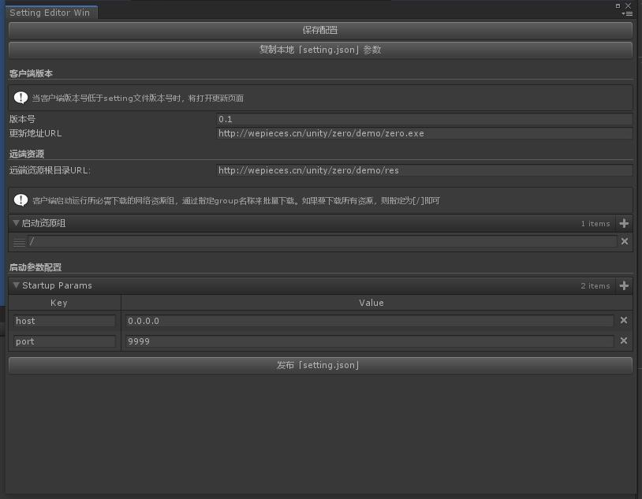

# Setting

>当使用热更资源模式开发项目的时候，setting.json文件会在preload中第一个被加载，其中描述了预热相关的重要信息。

配置内容:

- [客户端版本](#客户端版本)
- [远端资源](#远端资源)
- [启动参数配置](#启动参数配置)

## 界面截图

## 客户端版本

***客户端版本号***

在[检查/更新客户端](Preload.md)中使用。比对*Application.version*版本号，如果高于*Application.version*，则会进入客户端安装文件更新流程。

***客户端URL***

需要更新客户端时，从该参数获取网络地址。

## 远端资源

***远端资源目录***

该参数为URL，程序中需要的热更资源都将从该目录下下载

***启动资源组列表***

当我们项目中的资源数量过多时，可以在这里配置preload预热时必须要的资源。其它的资源可以启动程序后，在需要时单独下载。
当指定/时则表示全部资源，如果要只下载dll目录，则可以改为/dll。如果要具体到文件，可以为/ab/hot_res/audios.ab这样。

## 启动参数配置

当我们在启动程序时希望带入的参数。程序启动后可以通过[Runtime.Ins.setting.startupParams]()来获取